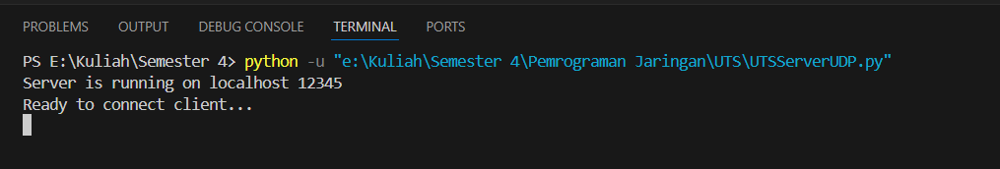
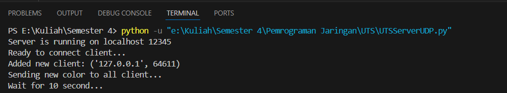
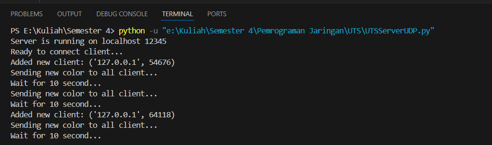
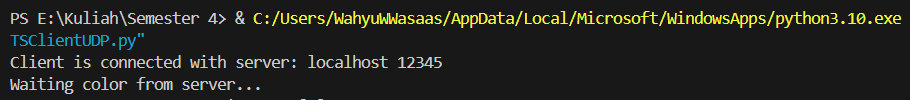
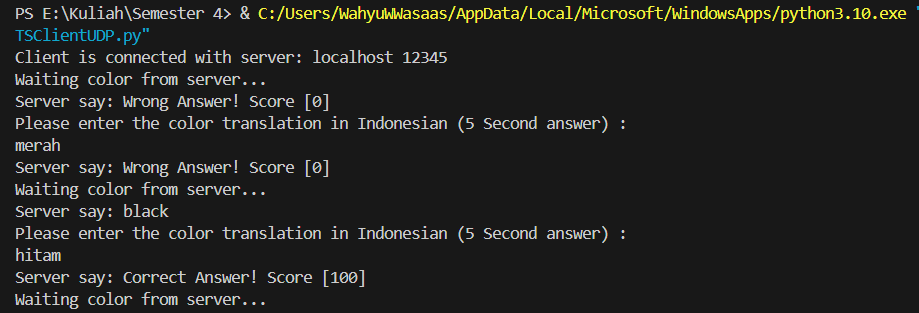
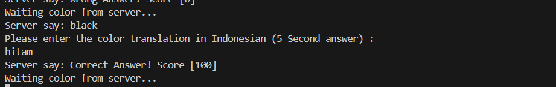
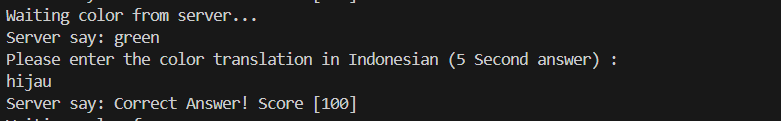
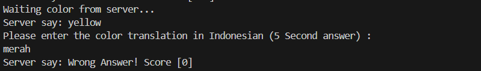
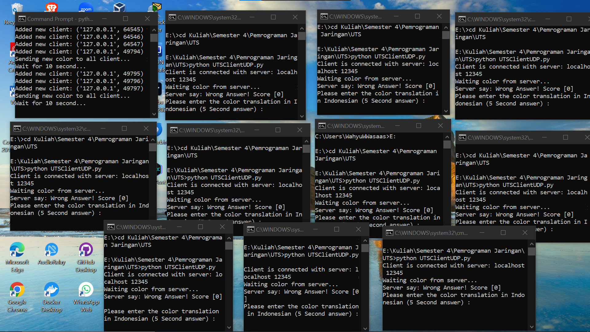
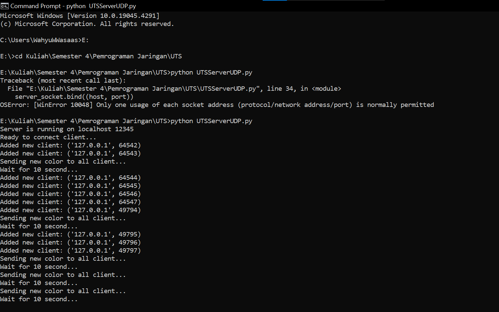

# UTS Pemrograman Jaringan
Nama : Wahyu Adam Anandika
NIM : 1203220046

## Penjelasan Program
Program ini menggunakan bahasa `Python` menggunakan socket dan protokol UDP. Program ini berisi permainan menerjemahkan warna bahasa inggris yang dikirim dari server dan dijawab oleh client dengan bahasa indonesia. Jika benar maka akan mendapat score 100 dan jika salah score menjadi 0. Program ini menggunakan 2 thread yang pertama untuk mengirim warna dan yang ke dua untuk memberikan jawaban score.

## Souce Code Server
```python
import socket
import time
import random
from threading import Thread

# Daftar warna dalam bahasa Inggris dan Indonesia
colors = {
    "red": "merah",
    "green": "hijau",
    "blue": "biru",
    "yellow": "kuning",
    "black": "hitam",
    "white": "putih"
}

selected_color = None  # Variabel global untuk menyimpan warna terpilih

# Fungsi untuk mengirim kata warna kepada semua klien
def send_color_to_all_clients():
    global selected_color  # Menggunakan variabel global
    while True:
        if clients:
            selected_color = random.choice(list(colors.keys()))
            for client in clients:
                server_socket.sendto(selected_color.encode(), client)
            print("Sending new color to all client...")
            print("Wait for 10 second...")
        time.sleep(10)

# Membuat soket UDP
server_socket = socket.socket(socket.AF_INET, socket.SOCK_DGRAM)
host = 'localhost'
port = 12345
server_socket.bind((host, port))

clients = set()
print(f"Server is running on {host} {port}")
print("Ready to connect client...")

# Thread untuk mengirim warna
thread = Thread(target=send_color_to_all_clients)
thread.start()

# Loop untuk menerima jawaban dan menambahkan klien baru
while True:
    message, address = server_socket.recvfrom(1024)
    if address not in clients:
        clients.add(address)
        print(f"Added new client: {address}")
    
    message = message.decode().lower()
    expected_answer = colors.get(selected_color, "")
    if message == expected_answer:
        server_socket.sendto("Correct Answer! Score [100]".encode(), address)
    else:
        server_socket.sendto("Wrong Answer! Score [0]".encode(), address)

```

## Source Code Client
```python
import socket
import time

# Fungsi untuk mengirim jawaban ke server
def send_response(server_address, color_translation):
    client_socket.sendto(color_translation.encode(), server_address)

# Membuat soket UDP
client_socket = socket.socket(socket.AF_INET, socket.SOCK_DGRAM)
server_host = 'localhost'
server_port = 12345

# Mengirim pesan inisialisasi ke server untuk memulai komunikasi
init_message = "Hello, server!"
client_socket.sendto(init_message.encode(), (server_host, server_port))

print(f"Client is connected with server: {server_host} {server_port}")

# Loop untuk menerima warna dan mengirim jawaban
while True:
    print("Waiting color from server...")
    data, server = client_socket.recvfrom(1024)
    color_received = data.decode()
    print(f"Server say: {color_received}")
    
    # Mendapatkan jawaban dari user
    print("Please enter the color translation in Indonesian (5 Second answer) :")
    user_answer = input()
    send_response(server, user_answer)
    
    # Menerima feedback dari server
    feedback, server = client_socket.recvfrom(1024)
    print(f"Server say: {feedback.decode()}")

```

## How Code Works & Screenshot
### A. Server Work
1. Jalankan code server, contoh menggunakan terminal vs code.
2. Server akan menampilkan ready to conect client

2. Jika client sudah terhubung server akan memulai thread mengirimkan warna ke server secara terus meneruh tiap 10 detik.

3. Jika ada client terhubung lagi maka server akan menampilkan `"Added new client : address"`


### B. Client Work
1. Jalankan code client, contoh menggunakan terminal vs code. Untuk menjalankan beberapa client dibutuhkan terminal yang berbeda.
2. Jika server sudah hidup maka client dapat langsung terhubung ke server

3. Server akan mengirim kan warna setiap 10 detik setelah client menjawab, untuk merefresh jawaban server. Untuk output pertama server memiliki error tidak mengirim warna harus di pancing dengan jawaban lalu program akan normal.

4. Client hanya mempunyai waktu 5 detik untuk menjawab dan menunggu 10 detik untuk menerima jawaban dan warna lain dari server

5. Jika jawaban benar maka akan memberikan score 100 dan jika salah akan memberikan score 0
- Contoh benar :

- Contoh Salah :


## Test Case : 1 Server & 10 Client running
Berikut Screnshot dari server dan client yang dijalankan
- 1 Server & 10 Client running :


- Tampilan Server :

